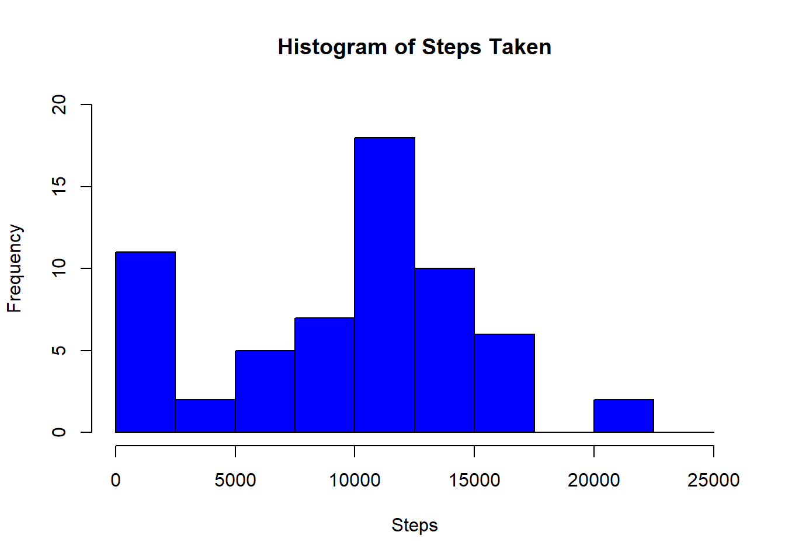
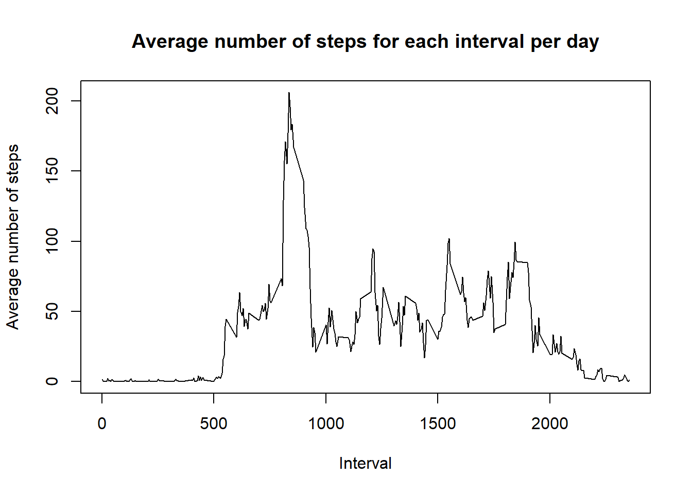
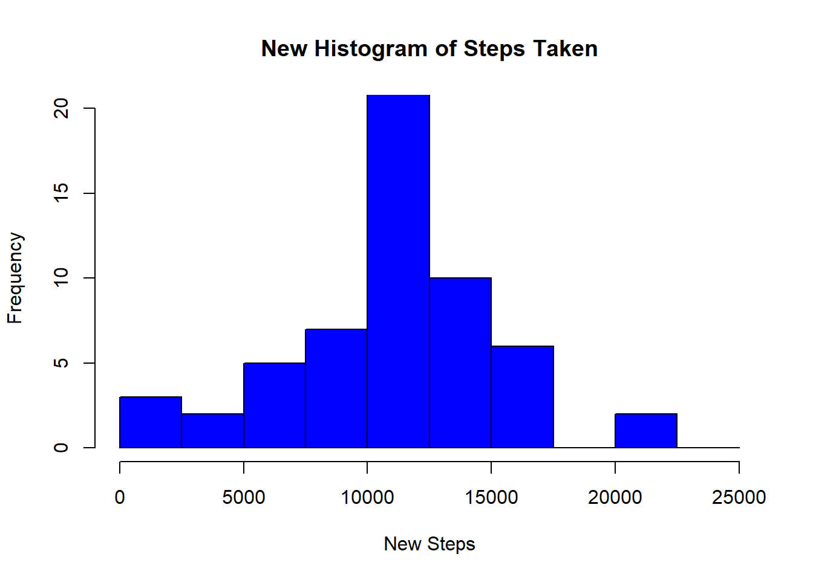
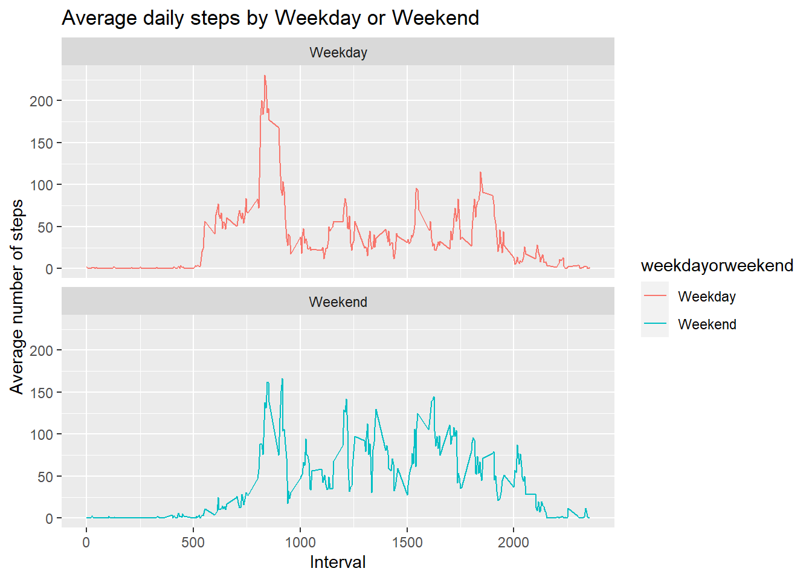

## Loading and Preprocessing the data
First we load the link, download the data then unzip it, followed by loading the data into the variable 'data'.

```r
fileURL <- "https://d396qusza40orc.cloudfront.net/repdata%2Fdata%2Factivity.zip"
download.file(fileURL,destfile = "./newzip.zip")
unzip("./newzip.zip")
data <- read.csv("activity.csv")
```
## What is the mean total number of steps taken per day 
First we plot the histogram  

```r
data$date <- as.Date(data$date,format = "%Y-%m-%d")
Totalsteps <- tapply(data$steps,data$date,FUN = sum, na.rm=TRUE)
hist(Totalsteps,xlab = "Steps",col="blue", main = "Histogram of Steps Taken",breaks = seq(0,25000,by=2500),ylim = c(0,20))
```


  
  Next, the mean is:

```r
mean(Totalsteps)
```

```
## [1] 9354.23
```
Median is:

```r
median(Totalsteps)
```

```
## [1] 10395
```
## What is the average daily activity pattern
We need to make a timeseries plot of average number of steps wrt each interval. So first, we create a new table, averagesteps which gets the average number of steps based on each interval.

```r
averagesteps <- aggregate(data$steps,by=list(data$interval),FUN=mean,na.rm=TRUE)
names(averagesteps)<-c("interval","averagesteps")
```
We now plot  

```r
plot(x=averagesteps$interval,y=averagesteps$averagesteps,type="l",xlab="Interval",ylab="Average number of steps",main="Average number of steps for each interval per day")
```


  
  Now we find the maximum average steps and the corresponding interval, I've used the tapply function

```r
maxstepsinterval<-tapply(averagesteps$interval,averagesteps$averagesteps,FUN=max)
tail(maxstepsinterval,n=1)
```

```
## 206.169811320755 
##              835
```
## Inputing missing values
We first find the total number of missing data

```r
sum(is.na(data$steps))
```

```
## [1] 2304
```
Now we create a duplicate dataset where we need to assign values to the missing values

```r
newdata<-data
```
We then, assign the mean value of each interval, as calculated earlier and assign it to the newdata dataset.

```r
newdata[is.na(data$steps),]$steps<-averagesteps$averagesteps
```
Then as previously plotted for histogram, we do the same again:  

```r
Newtotalsteps <- tapply(newdata$steps,newdata$date,FUN = sum, na.rm=TRUE)
hist(Newtotalsteps,xlab = "New Steps",col="blue", main = "New Histogram of Steps Taken",breaks = seq(0,25000,by=2500),ylim = c(0,20))
```


  
  Calculate mean:

```r
mean(Newtotalsteps)
```

```
## [1] 10766.19
```
Calculate Median:

```r
median(Newtotalsteps)
```

```
## [1] 10766.19
```
## Are there differences in activity patterns between weekdays and weekends?
We create a duplicate of the newdata dataset just for my convenience

```r
newdata1 <- newdata
```
Create a column called day of week using the weekdays() function

```r
newdata1$dayofweek <- weekdays(newdata1$date)
```
Create a column called weekdaysorweekends based on the type of day

```r
newdata1$weekdayorweekend <- sapply(newdata1$date, function(x) {
  if (weekdays(x) == "Sunday" | weekdays(x) =="Saturday") 
  {y <- "Weekend"} else 
  {y <- "Weekday"}
  y
})
```
We used an if-else function along with an sapply to get it done.

Now, lets create our dataset sorted by weekday or weekend:

```r
newavgsteps <- aggregate(steps~interval+weekdayorweekend,newdata1,mean,na.rm=TRUE) 
```
Load the ggplot2 library

```r
library(ggplot2)
```

Now we plot based on the facet of weekday or weekend  

```r
plot<- ggplot(newavgsteps, aes(x = interval , y = steps, color = weekdayorweekend)) +
  geom_line() +
  labs(title = "Average daily steps by Weekday or Weekend", x = "Interval", y = "Average number of steps") +
  facet_wrap(~weekdayorweekend, ncol = 1, nrow=2)
print(plot)
```


  
  That concludes our activity. Thanks for reading.
